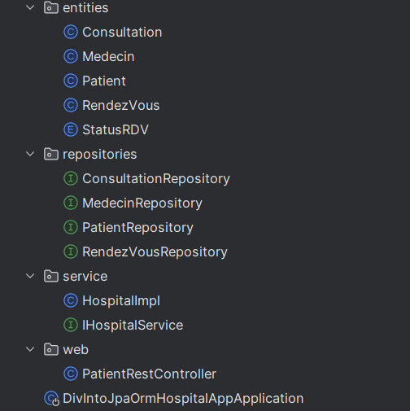
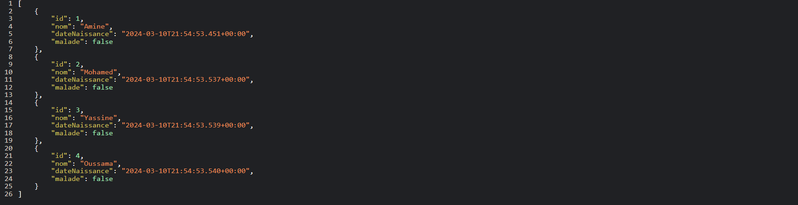

# Application Hospitalière DivInto JPA ORM

Ce projet, "DivInto JPA ORM Hospital App", est un système de gestion hospitalière complet construit en utilisant Java, Spring Boot et Maven. Il tire parti de la puissance de Java Persistence API (JPA) et de l'Object-Relational Mapping (ORM) pour interagir avec la base de données.

L'application est structurée en plusieurs composants clés :

- **Entités** : Ce sont des classes Java qui correspondent aux tables de la base de données. Les entités de cette application comprennent `Patient`, `Medecin` (Docteur), `RendezVous` (Rendez-vous) et `Consultation`. Ces entités représentent les structures de données centrales du système hospitalier.

- **Dépôts** : Ce sont des interfaces qui étendent `JpaRepository` de Spring Data JPA. Ils fournissent des méthodes pour effectuer des opérations CRUD (Create, Read, Update, Delete) sur les entités. Les dépôts de cette application comprennent `PatientRepository`, `MedecinRepository`, `RendezVousRepository` et `ConsultationRepository`.

- **Services** : Ce sont des classes qui contiennent la logique métier et appellent des méthodes des dépôts. Le service principal de cette application est `HospitalService`, qui fournit des méthodes pour gérer les patients, les médecins, les rendez-vous et les consultations.

- **Contrôleurs** : Ce sont des classes qui gèrent les requêtes et les réponses HTTP. Ils fournissent des points d'extrémité pour interagir avec le système hospitalier. Le contrôleur principal de cette application est `PatientRestController`, qui fournit un point d'extrémité pour récupérer tous les patients.

- **Application principale** : La classe `DivIntoJpaOrmHospitalAppApplication` est le point d'entrée de l'application. Elle contient une méthode `main` qui démarre l'application. Elle contient également un bean `CommandLineRunner` qui peuple la base de données avec des données initiales lorsque l'application démarre.

## Fonctionnalités traitées

Ce projet traite plusieurs fonctionnalités clés pour gérer un système hospitalier :

- **Gestion des patients** : L'application permet d'enregistrer de nouveaux patients, de mettre à jour les informations des patients existants, de récupérer les détails des patients et de supprimer les patients de la base de données.

- **Gestion des médecins** : L'application permet d'ajouter de nouveaux médecins, de mettre à jour les informations des médecins existants, de récupérer les détails des médecins et de supprimer les médecins de la base de données.

- **Gestion des rendez-vous** : L'application permet de planifier de nouveaux rendez-vous, de mettre à jour les détails des rendez-vous existants, de récupérer les détails des rendez-vous et de supprimer les rendez-vous de la base de données.

- **Gestion des consultations** : L'application permet d'ajouter de nouvelles consultations, de mettre à jour les informations des consultations existantes, de récupérer les détails des consultations et de supprimer les consultations de la base de données.

- **Migration de la base de données** : Le projet comprend également une migration de la base de données de H2 à SQL pour une meilleure persistance et performance.

Ces fonctionnalités sont implémentées en utilisant une architecture à plusieurs couches comprenant des entités, des dépôts, des services et des contrôleurs. Chaque couche a une responsabilité spécifique, ce qui rend le code plus organisé, plus facile à comprendre et à maintenir.

### Installation

Une série d'exemples étape par étape qui vous expliquent comment mettre en place un environnement de développement :

1. Clonez le dépôt : `git clone https://github.com/YassinMk/DivInto-jpa-orm-TP.git`
2. Ouvrez le projet dans votre IDE
3. Exécutez la méthode principale dans la classe `DivIntoJpaOrmHospitalAppApplication`

## Exécution des tests

Expliquez comment exécuter les tests automatisés pour ce système.

## Construit avec

* [Java](https://www.java.com/) - Le langage de programmation utilisé
* [Spring Boot](https://spring.io/projects/spring-boot) - Le framework utilisé
* [Maven](https://maven.apache.org/) - Gestion des dépendances

## Auteurs

* **YassinMk** - *Travail initial* - [YassinMk](https://github.com/YassinMk)

## Licence

Ce projet est sous licence MIT - voir le fichier [LICENSE.md](LICENSE.md) pour plus de détails
