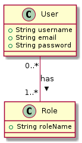

# Application DivIntoJpaOrmRelationalDb

C'est une application Spring Boot qui démontre l'utilisation de l'API de Persistance Java (JPA) pour gérer les données relationnelles dans une application Java.

## Aperçu du projet

L'application utilise Spring Boot, un framework populaire pour construire des applications Spring autonomes de qualité production. Elle utilise également Maven comme outil de construction.

L'application démontre l'utilisation de JPA pour gérer les données relationnelles. JPA est une spécification pour accéder, persister et gérer les données entre les objets Java et une base de données relationnelle. Cette application utilise JPA pour gérer les entités Utilisateur et Rôle dans une base de données en mémoire H2.


## Configuration et exécution

1. Clonez le dépôt sur votre machine locale.
2. Ouvrez le projet dans IntelliJ IDEA 2023.3.2 ou tout autre IDE qui supporte Java et Spring Boot.
3. Exécutez le fichier `DivIntoJpaOrmRelationalDbApplication.java` pour démarrer l'application.

L'application fonctionne sur le port 8083 et peut être accédée à `http://localhost:8083`.


## Base de données et relation entre les entités

L'application utilise une base de données en mémoire H2 pour stocker les données. La connexion à la base de données est configurée dans le fichier `application.properties` :

```properties
spring.datasource.url=jdbc:h2:mem:user_db
````

## Fonctionnalités

L'application a les fonctionnalités suivantes :

- Entités Utilisateur et Rôle : Ce sont les principales entités de l'application. Un Utilisateur peut avoir plusieurs Rôles.
- UserService : Cette classe de service fournit des méthodes pour ajouter de nouveaux Utilisateurs et Rôles, et pour attribuer des Rôles aux Utilisateurs.
- UserController : Cette classe de contrôleur fournit un point d'extrémité REST pour récupérer un Utilisateur par son nom d'utilisateur.

## Relations JPA

L'application démontre l'utilisation de JPA pour gérer les relations entre les entités. Dans ce cas, un Utilisateur peut avoir plusieurs Rôles, démontrant une relation Plusieurs-à-Plusieurs. Cette relation est gérée en utilisant l'annotation `@ManyToMany` de JPA.

## Contribuer

Les contributions sont les bienvenues. Veuillez ouvrir un problème ou soumettre une demande de tirage pour toute contribution.

